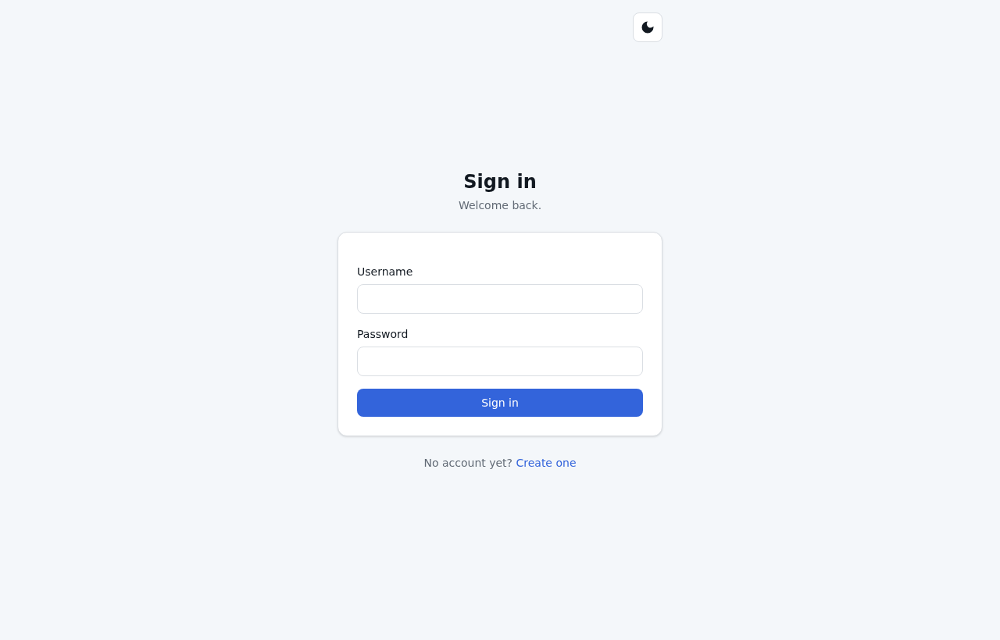
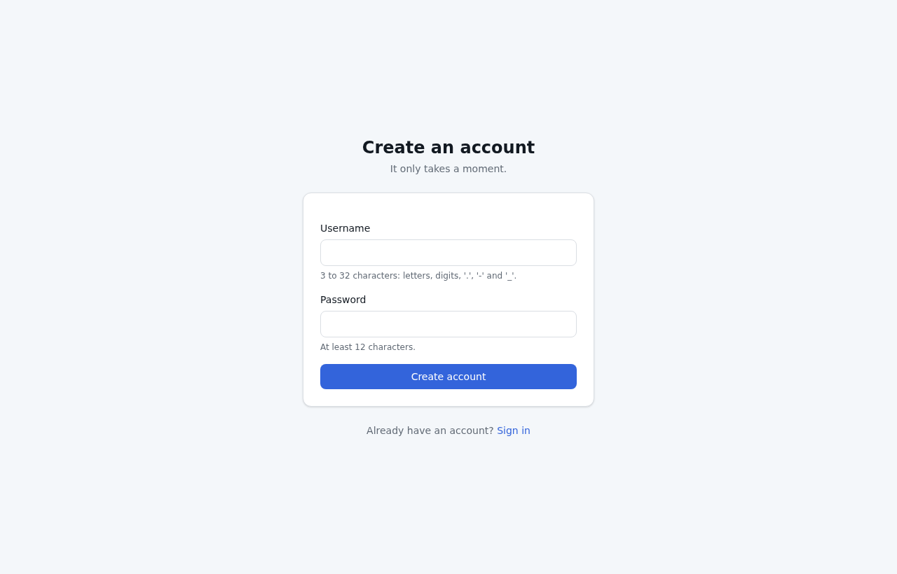
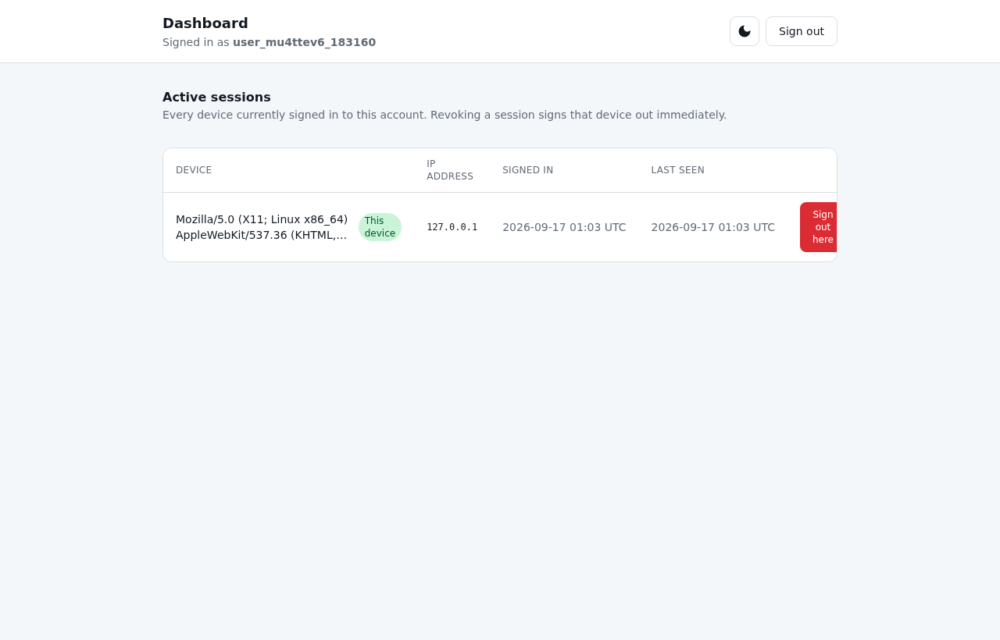

# Leptos + Axum Workspace

A production-ready starting point for full-stack Rust web applications: one
binary that server-renders HTML, hydrates it in the browser, and talks to
Postgres through type-checked queries — with authentication, observability,
CI/CD and a container image already wired up.

> **Stack:** Rust 1.97.1 · Leptos 0.8 (SSR + hydration) · Axum 0.8 · sqlx 0.9 ·
> Tailwind CSS v4 · PostgreSQL 16 · Playwright

## Contents

- [Screens](#screens)
- [Why this exists](#why-this-exists)
- [Quick start](#quick-start)
- [Project layout](#project-layout)
- [What is included](#what-is-included)
- [Pages](#pages)
- [Testing](#testing)
- [Common tasks](#common-tasks)
- [Configuration](#configuration)
- [Documentation](#documentation)
- [A note on Leptos](#a-note-on-leptos)
- [License](#license)

---

## Screens

Every route is server-rendered and usable before JavaScript loads. A dark mode
is applied before first paint, and a real 404 page returns a 404 status.

| | |
| --- | --- |
| **Sign in** — `/signin` | **Create account** — `/signup` |
|  |  |
| **Dashboard** — `/` (signed in) | **Not found** — any unmatched route |
|  |  |

> Screenshots are captured from the release build with a desktop viewport in the
> default (light) theme. A signed-in account shows the session management table;
> the "This device" badge marks the current session.

## Why this exists

Most Leptos+Axum starters give you two applications that happen to share a
repository: a client-rendered SPA and a REST API, with the contract between them
maintained by hand. This one is a single application. The UI and the server share
one codebase, one set of types, and one definition of every endpoint.

Concretely:

- **Server functions instead of a REST client.** An `#[server]` function compiles
  into an HTTP handler and a typed client call from one definition. There are no
  URL literals, no hand-written `serde_json`, and no response envelope to unwrap.
  Change an argument type and both sides fail to compile — together.
- **One definition of every validation rule.** `Username::parse` runs in the
  browser for live feedback and on the server before the insert. There is no
  second copy to drift.
- **Pages that work before JavaScript does.** Every route is server-rendered and
  every form is a real `<form>`, so the app is usable — and indexable — with
  scripting disabled. There is a Playwright project that proves it.

## Quick start

Requires [Rust](https://rustup.rs), [just](https://github.com/casey/just),
[cargo-leptos](https://github.com/leptos-rs/cargo-leptos),
[sqlx-cli](https://crates.io/crates/sqlx-cli), and a Postgres you can reach.

```bash
cp .env.example .env          # set DATABASE_URL
just migrate                  # create the schema
just dev                      # http://127.0.0.1:3000, with hot reload
```

Or, with Docker only:

```bash
cp .env.example .env
docker compose up --build
```

Run `just` on its own to see every available task.

## Project layout

```text
.
├── crates/
│   ├── core/        Wire contracts: validated newtypes, DTOs, the error enum.
│   │                Compiles to wasm as well as native — keep it dependency-light.
│   ├── domain/      Server-side logic: config, migrations, repositories, auth.
│   │                Contains no Leptos code at all.
│   ├── app/         UI components, routes, and every `#[server]` function.
│   │                Compiled twice: `ssr` for the server, `hydrate` for the browser.
│   ├── frontend/    The wasm entrypoint. Fifteen lines that hand the DOM to `app`.
│   └── server/      The Axum binary: router, middleware, health probes, shutdown.
├── migrations/      Versioned schema changes, applied at startup.
├── .sqlx/           Committed query cache, so `cargo check` needs no database.
├── style/main.css   Tailwind v4, CSS-first. No JavaScript config, no Node.js.
├── end2end/         Playwright: auth, sessions, accessibility, and a no-JS suite.
└── docs/            Architecture notes, an operations runbook, and ADRs.
```

Dependencies flow one way: `core ← domain ← app ← {frontend, server}`.

`domain` is a separate crate for a concrete reason. Server functions must live in
the UI crate, but their bodies need database access; putting that access in
`server` would make `app` and `server` mutually dependent, which Cargo forbids.
Splitting it out also keeps every line of backend logic free of Leptos, so the UI
layer can be replaced without touching it.

## What is included

**Authentication** — a complete vertical slice to copy from. Argon2id password
hashing, opaque 256-bit session tokens stored only as SHA-256 digests, `HttpOnly`
cookies with the `__Host-` prefix in production, sliding expiry, per-account rate
limiting, and cross-device session listing and revocation.

**Persistence** — sqlx with `query_as!`, so every statement is checked against the
real schema at compile time. Migrations are versioned and run at startup under an
advisory lock, so several replicas can boot at once.

**Observability** — structured `tracing` with request-id correlation, JSON output
in production, and separate liveness and readiness probes.

**Front end** — URL routing with deep links and working browser history,
`Resource`/`Action`/`Suspense`/`ErrorBoundary` for data flow, a small component
set that owns its own accessibility behaviour, and a dark mode that is applied
before first paint.

**Delivery** — one container image built with `cargo-chef` layer caching, running
as a non-root user with a healthcheck. CI lints every crate on both targets, runs
unit, integration, browser and accessibility tests, audits the dependency tree,
and publishes a multi-architecture image with an SBOM and build provenance.

## Pages

| Route | Page | Behaviour |
| --- | --- | --- |
| `/` | Dashboard | Authenticated landing page. Guards a `current_user()` check on the server, redirecting signed-out visitors to `/signin`. Lists active sessions with revoke controls. |
| `/signin` | Sign in | Server-side validation only — failures are deliberately indistinguishable so usernames cannot be enumerated. Rate limited per (address, username). |
| `/signup` | Create an account | Live per-field validation that runs the same `Username::parse` / `Password::parse` the server uses, in the browser, before submit. |
| any other path | Not found | Real 404 — returns a non-200 status, and a "Back to the dashboard" link. |

There is also a `ThemeToggle` on every page that switches light/dark mode without
a flash, applied before first paint.

## Testing

`just ci` is the single gate — it runs exactly what the pipeline runs, in order:
format check, clippy on native *and* wasm, unit + integration tests, dependency
audit, and the release build.

Browser tests run separately against a real `cargo leptos serve`:

- **End-to-end suites** (Chromium, Firefox, mobile) exercise auth and sessions
  with role- and label-based selectors.
- **A `no-javascript` project** proves server rendering works with scripting
  disabled — it would fail against any client-rendered build.
- **Accessibility scans** (axe-core) run over every page in light *and* dark
  themes, and a contrast violation is a build failure.

To update the committed `.sqlx` query cache after changing a query:

```bash
just prepare
```

## Common tasks

| Command | What it does |
| --- | --- |
| `just dev` | Run with hot reload |
| `just test` | Unit and integration tests |
| `just lint` | Format check and clippy, native **and** wasm |
| `just e2e` | Playwright suites |
| `just ci` | Everything CI runs, in the same order |
| `just migrate-new <name>` | Create a reversible migration |
| `just prepare` | Refresh the `.sqlx` cache after changing a query |
| `just db-reset` | Drop, recreate and re-migrate the dev database |

## Configuration

Every setting has a safe default except `DATABASE_URL`, which the process
refuses to start without — there is deliberately no built-in fallback connection
string. See [`.env.example`](.env.example) for the full list.

Two settings deserve attention before deploying:

- `APP_ENV=production` enables `Secure` cookies, the `__Host-` cookie prefix,
  HSTS and JSON logging. Leaving it at `development` in production means session
  cookies without `Secure`.
- `TRUSTED_PROXY_HOPS` must equal the number of reverse proxies actually in front
  of the process. The default `0` ignores `X-Forwarded-For` entirely and records
  the TCP peer address. Setting it higher than reality lets a client choose the
  address recorded against its own sessions.

## Documentation

- [`docs/architecture.md`](docs/architecture.md) — how a request flows through
  the system, and the security properties that are enforced where.
- [`docs/runbook.md`](docs/runbook.md) — deploying, migrating, and diagnosing
  problems in production.
- [`docs/adr/`](docs/adr/) — why the significant decisions were made, including
  the alternatives that were rejected.
- [`CONTRIBUTING.md`](CONTRIBUTING.md) — how to propose a change.
- [`SECURITY.md`](SECURITY.md) — how to report a vulnerability.
- [`CODE_OF_CONDUCT.md`](CODE_OF_CONDUCT.md) — the community code of conduct.
- [`CHANGELOG.md`](CHANGELOG.md) — keep a changelog, broken down by version.

Also see [`AGENTS.md`](AGENTS.md) for the conventions enforced on every change:
layering and security expectations.

## A note on Leptos

Leptos was declared feature-complete and lightly maintained by its author in
[May 2026](https://github.com/leptos-rs/leptos/issues/4707). For a foundation
template that is largely an asset: the API is stable and will not churn, and
bug-fix releases have continued. It does mean new framework features are
unlikely, and it is why `crates/domain` carries no Leptos dependency — if the UI
layer ever needs replacing, the backend does not.

## License

Apache-2.0. See [LICENSE](LICENSE).
